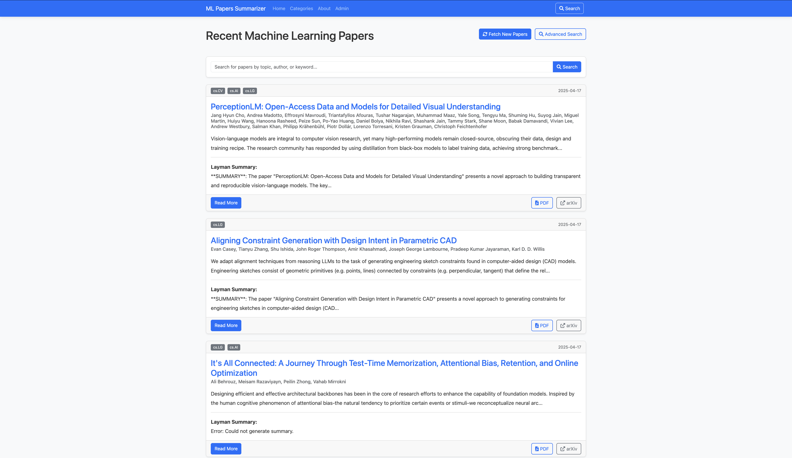
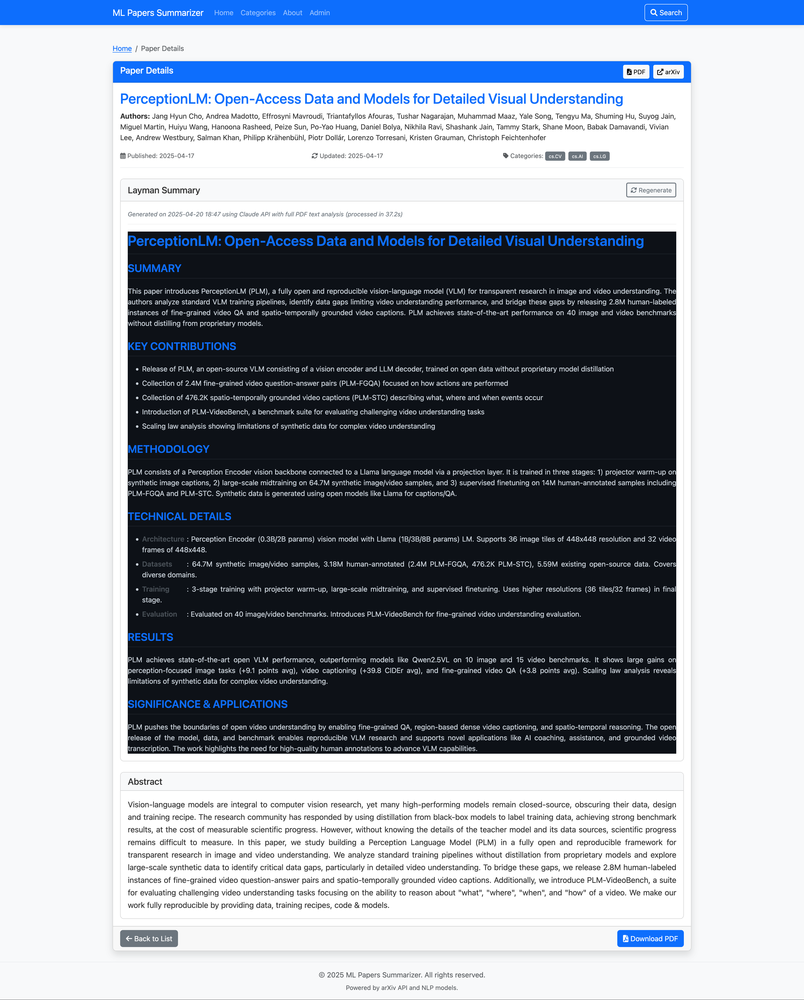
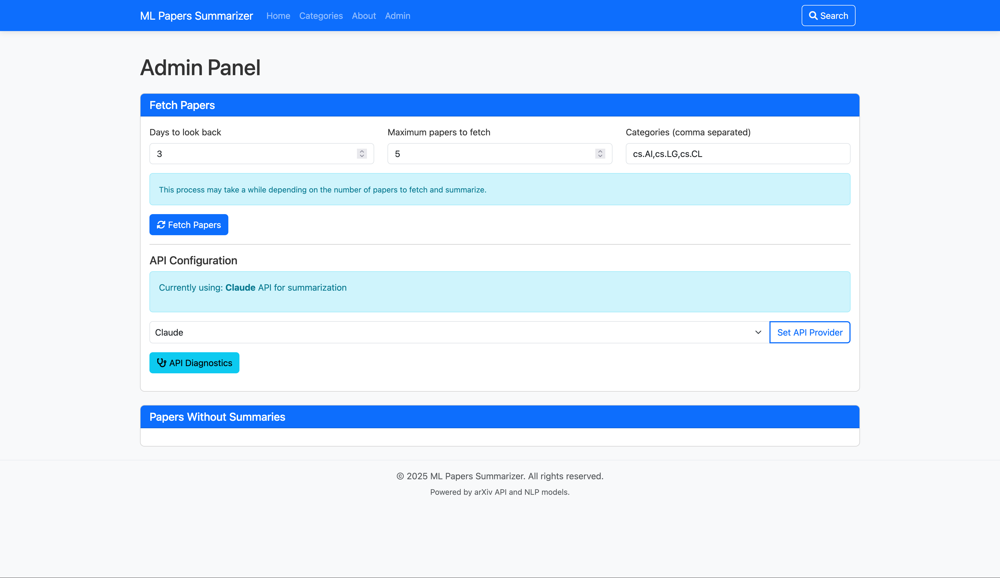

# MLPapers Scraper and Summarizer

A web application that scrapes recent Machine Learning research papers from arXiv and generates summaries using either OpenAI or Claude API. This project demonstrates how to implement a resilient AI-powered system that can seamlessly switch between different language model providers.

**Live Demo**: [https://mlpapers-summarizer.onrender.com](https://mlpapers-summarizer.onrender.com)

## Project Motivation

I created this project to address a personal pain point. As I started building ML projects both for university assignments and personal skill improvement, I found myself spending excessive time searching through research papers to find useful techniques and stay current with the industry. 

This tool automates the most time-consuming parts:
1. Discovering new papers in specific ML categories
2. Reading and understanding technical papers quickly
3. Extracting the key contributions and methodologies

By scraping papers from arXiv and leveraging AI to generate comprehensive summaries directly from the full PDF content, this project has significantly cut down the labor involved in staying up-to-date with ML research.

## Key Features

- **Dual API Support**: Integration with both OpenAI and Claude APIs, with fallback options if one service is unavailable
- **Full PDF Analysis**: Extracts text directly from research paper PDFs to generate more comprehensive and accurate summaries
- **Automated Scraping**: Retrieves recent ML research papers from arXiv based on categories and keywords
- **AI Summarization**: Generates concise, structured summaries of complex research papers
- **Provider Selection**: Choose which AI model to use for summarization through an intuitive admin interface
- **API Diagnostics**: Built-in tools to check API connection status and troubleshoot problems

The application is designed to be resilient to API outages or quota limitations by supporting multiple providers. If one service is unavailable, it can automatically switch to the other.

## Screenshots

### Home Page
View recently scraped papers from arXiv with their summaries, categorized for easy browsing.


### Paper Detail
Read detailed information about a paper along with an AI-generated summary that breaks down complex research into digestible sections. Summaries are now generated using the full paper PDF, not just the abstract.


### Admin Panel
Manage papers and control which AI provider to use for summarization. The dropdown allows switching between OpenAI, Claude, or automatic selection.


### API Diagnostics
Check the status of your API connections and troubleshoot issues. As shown here, the system can detect when one API has quota limitations while another is working properly.


## Setup

1. Clone the repository
   ```
   git clone <repository-url>
   cd MLPapers_scraper-summarizer
   ```

2. Create and activate a virtual environment
   ```
   python -m venv venv
   source venv/bin/activate  # On Windows: venv\Scripts\activate
   ```

3. Install dependencies
   ```
   pip install -r requirements.txt
   ```

4. Set up environment variables
   - Copy `.env.example` to `.env`
   - Configure your API keys (see API Configuration section)

5. Run the application
   ```
   python app.py
   ```
   
6. Access the web interface at `http://localhost:5001`

   > **Note for macOS users**: If you encounter an error with port 5000 (the default Flask port), this is likely due to AirPlay using this port. The application has been configured to use port 5001 instead, but if you need to change it, you can modify the port in `app.py`.

## API Configuration

The application supports two AI providers for generating summaries:

### Option 1: OpenAI API
1. Go to https://platform.openai.com/account/api-keys to get your API key
2. Add your key to the `.env` file:
   ```
   OPENAI_API_KEY=sk-your-openai-key-goes-here
   ```

### Option 2: Claude API
1. Go to https://console.anthropic.com/ to get your API key
2. Add your key to the `.env` file:
   ```
   ANTHROPIC_API_KEY=sk-ant-your-key-goes-here
   ```

You can provide either one or both API keys. The application is designed to work with just one of the services if needed.

## Enhanced Summary Generation

The latest version now extracts text directly from paper PDFs to generate significantly more comprehensive summaries:

1. **PDF Download**: Automatically downloads the PDF from arXiv
2. **Text Extraction**: Processes and extracts the content from the research paper
3. **Deep Analysis**: AI models analyze the full paper content, not just the abstract
4. **Structured Output**: Generates well-formatted summaries with detailed technical content

This produces summaries that capture implementation details, experimental results, and nuances that aren't available in the abstract alone.

## Switching Between API Providers

In the Admin Panel, you can select which AI provider to use for summarization:

1. **Auto**: The application will automatically use available APIs, with Claude preferred if both are available
2. **OpenAI**: Force using OpenAI's GPT model even if Claude is available
3. **Claude**: Force using Claude even if OpenAI is available

You can also check the API connection status with the API Diagnostics tool in the Admin Panel.

## Usage

- **Home Page**: View recently scraped papers
- **Paper Details**: Click on a paper to view its details and AI-generated summary
- **Admin Panel**: Access admin functionality to manage papers and trigger updates
  - Set API provider preferences
  - Check API status
  - Generate missing summaries

## Deployment

### Deploying on Render

This project is configured for easy deployment to Render's free tier:

1. Fork/clone this repository to your GitHub account
2. Create a new Web Service on Render, connecting to your GitHub repository
3. Render will automatically detect the configuration in `render.yaml`
4. Add your API keys as environment variables in the Render dashboard:
   - `OPENAI_API_KEY` (if using OpenAI)
   - `ANTHROPIC_API_KEY` (if using Claude)
5. The application will be deployed and accessible via your Render URL

**Auto-Deployment**: Once set up, any changes pushed to your main branch will automatically trigger a new deployment on Render. This continuous deployment feature ensures your live site always reflects the latest code in your repository.

Note: On Render's free tier, the application will sleep after 15 minutes of inactivity. The first request after inactivity may take 30-60 seconds to respond.

## Troubleshooting

If you encounter API issues:

1. Check your API keys are correctly set in the `.env` file
2. Use the API Diagnostics tool in the Admin Panel to test connections
3. Look at the `app.log` and `summarizer.log` files for detailed error messages

If you encounter port issues on macOS:
1. The application is configured to use port 5001 to avoid conflicts with AirPlay (which uses port 5000)
2. If needed, you can disable AirPlay Receiver in System Preferences > General > AirDrop & Handoff
3. Alternatively, you can change the port in `app.py`

## Contributing

Contributions are welcome! Please feel free to submit a Pull Request.

## License

[MIT License](LICENSE) 