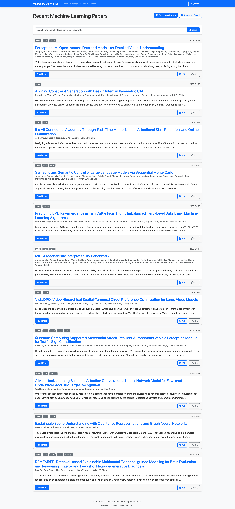
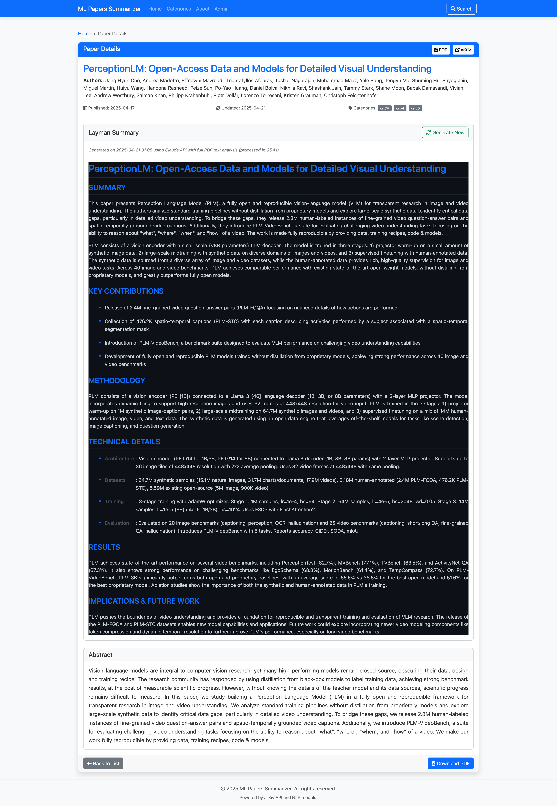

# MLPapers Scraper and Summarizer

A web application that scrapes recent Machine Learning research papers from arXiv and generates summaries using either OpenAI or Claude API. This project demonstrates how to implement a resilient AI-powered system that can seamlessly switch between different language model providers.

## Key Features

- **Dual API Support**: Integration with both OpenAI and Claude APIs, with fallback options if one service is unavailable
- **Automated Scraping**: Retrieves recent ML research papers from arXiv based on categories and keywords
- **AI Summarization**: Generates concise, structured summaries of complex research papers
- **Provider Selection**: Choose which AI model to use for summarization through an intuitive admin interface
- **API Diagnostics**: Built-in tools to check API connection status and troubleshoot problems

The application is designed to be resilient to API outages or quota limitations by supporting multiple providers. If one service is unavailable, it can automatically switch to the other.

## Screenshots

### Home Page
View recently scraped papers from arXiv with their summaries, categorized for easy browsing.


### Paper Detail
Read detailed information about a paper along with an AI-generated summary that breaks down complex research into digestible sections.


### Admin Panel
Manage papers and control which AI provider to use for summarization. The dropdown allows switching between OpenAI, Claude, or automatic selection.


### API Diagnostics
Check the status of your API connections and troubleshoot issues. As shown here, the system can detect when one API has quota limitations while another is working properly.


## Setup

1. Clone the repository
   ```
   git clone <repository-url>
   cd MLPapers_scraper-summarizer
   ```

2. Create and activate a virtual environment
   ```
   python -m venv venv
   source venv/bin/activate  # On Windows: venv\Scripts\activate
   ```

3. Install dependencies
   ```
   pip install -r requirements.txt
   ```

4. Set up environment variables
   - Copy `.env.example` to `.env`
   - Configure your API keys (see API Configuration section)

5. Run the application
   ```
   python app.py
   ```
   
6. Access the web interface at `http://localhost:5001`

## API Configuration

The application supports two AI providers for generating summaries:

### Option 1: OpenAI API
1. Go to https://platform.openai.com/account/api-keys to get your API key
2. Add your key to the `.env` file:
   ```
   OPENAI_API_KEY=sk-your-openai-key-goes-here
   ```

### Option 2: Claude API
1. Go to https://console.anthropic.com/ to get your API key
2. Add your key to the `.env` file:
   ```
   ANTHROPIC_API_KEY=sk-ant-your-key-goes-here
   ```

You can provide either one or both API keys. The application is designed to work with just one of the services if needed.

## Switching Between API Providers

In the Admin Panel, you can select which API provider to use for summarization:

1. **Auto**: The application will automatically use available APIs, with Claude preferred if both are available
2. **OpenAI**: Force using OpenAI's GPT model even if Claude is available
3. **Claude**: Force using Claude even if OpenAI is available

You can also check the API connection status with the API Diagnostics tool in the Admin Panel.

## Usage

- **Home Page**: View recently scraped papers
- **Paper Details**: Click on a paper to view its details and AI-generated summary
- **Admin Panel**: Access admin functionality to manage papers and trigger updates
  - Set API provider preferences
  - Check API status
  - Generate missing summaries

## Troubleshooting

If you encounter API issues:

1. Check your API keys are correctly set in the `.env` file
2. Use the API Diagnostics tool in the Admin Panel to test connections
3. Look at the `app.log` and `summarizer.log` files for detailed error messages

As shown in the API Diagnostics screenshot, you can easily identify issues like quota limits and switch to an alternative provider.

## Contributing

Contributions are welcome! Please feel free to submit a Pull Request.

## License

[MIT License](LICENSE) 